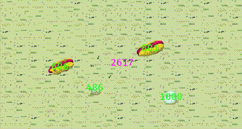

# Anthill

An ant simulator, a game I have made [over](https://github.com/sleepdeprivation/Ants) and [over](https://github.com/sleepdeprivation/antsim) throughout my time as a professional programmer.

### How does this work?

An anthill exists at the center of the screen, and expends some health points to produce ants. The ants wander semi-aimlessly (it varys by implementation) and eventually either die or find food. If they find food, they collect it and return directly to the anthill, leaving a trail of pheremones behind them. Any ant encountering these pheremones follows them back to the food, and continues the process. The pheremones left behind eventually decay.

### Why?

Why do I keep coming back to it? As a generalist, I really enjoy learning different programming languages, and implementing simple data stuctures and an architecture for managing them seems like a fun way to do it. I initially learned a lot about Javascript and how the browser canvas works, as well as Java/OOP paradigms through implementing this project. It's the type of project where even doing it very badly can teach you something.
